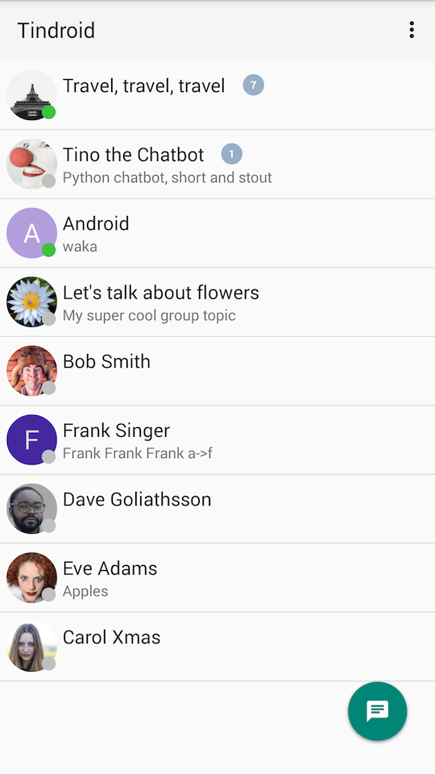
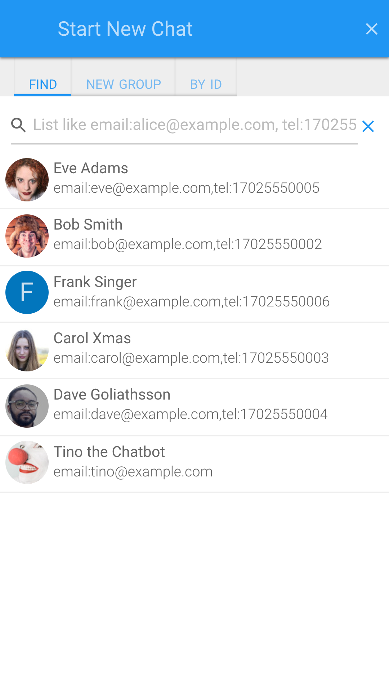

# Tinode Instant Messaging Server

 Instant messaging server. Backend in pure [Go](http://golang.org) (license [GPL 3.0](http://www.gnu.org/licenses/gpl-3.0.en.html)), custom client-side binding in Java and Javascript, as well as [gRPC](https://grpc.io/) client support for C++, C#, Go, Java, Node, PHP, Python, Ruby, Objective-C (license [Apache 2.0](http://www.apache.org/licenses/LICENSE-2.0)). Wire transport is JSON over websocket (long polling is also available) for custom bindings, or [protobuf](https://developers.google.com/protocol-buffers/) over plain TCP for gRPC. Persistent storage [RethinkDB](http://rethinkdb.com/) and MySQL. A third-party [DynamoDB adapter](https://github.com/riandyrn/chat/tree/master/server/db/dynamodb) also exists. Other databases can be supported by writing custom adapters.

Tinode is *not* XMPP/Jabber. It is *not* compatible with XMPP. It's meant as a replacement for XMPP. On the surface it's a lot like open source WhatsApp or Telegram.

Version 0.15. This is beta-quality software: feature-complete but probably with a few bugs. Follow [instructions](INSTALL.md) to install and run. Read [API documentation](docs/API.md).

## Why?

The promise of [XMPP](http://xmpp.org/) was to deliver federated instant messaging: anyone would be able to spin up an IM server capable of exchanging messages with any other XMPP server in the world. Unfortunately XMPP never delivered on this promse. Instant messengers are still a bunch of incompatible walled gardens, similar to what AoL of the late 1990s was to the open Internet.

The goal of this project is to actually deliver on XMPP's original vision: create a modern open platform for federated instant messaging with emphasis on mobile communication. A secondary goal is to create a decentralized IM platform which is much harder to track and block by the governments.

## Getting support

* Read [API documentation](docs/API.md) and [FAQ](docs/faq.md).
* For support, general questions, discussions post to [https://groups.google.com/d/forum/tinode](https://groups.google.com/d/forum/tinode).
* For bugs and feature requests [open an issue](https://github.com/tinode/chat/issues/new).

## Demo

### Web

TinodeWeb, a single page web app, is usually available at https://api.tinode.co/ ([source](https://github.com/tinode/webapp/)).

Login as one of `alice`, `bob`, `carol`, `dave`, `frank`. Password is `<login>123`, e.g. login for `alice` is `alice123`. You can discover other users by email or phone by prefixing them with `email:` or `tel:` respectively. Emails are `<login>@example.com`, e.g. `alice@example.com`, phones are `17025550001` through `17025550009`.

If you register a new account you are asked for an email address to send validation code to. For demo purposes you may use `123456` as a universal validation code. The code you get in the email is also valid.

[Docker images](https://hub.docker.com/u/tinode/) with the same demo are available.

### Android

[Tindroid](https://github.com/tinode/tindroid) is stable and functional. See screenshots below. A [debug APK](https://github.com/tinode/tindroid/releases/latest) is provided for convenience.

### Command Line

A text-only [command line client](./tn-cli) implements every possible command.

### Notes

* The demo server is reset (all data wiped) every night at 3:15am Pacific time. An error message `User not found or offline` means the server was reset while you were connected. If you see it on the web, reload and relogin. On Android log out and re-login. If the database was changed, delete the app then reinstall.

* User `Tino` is a [basic chatbot](./chatbot) which responds with a [random quote](http://fortunes.cat-v.org/) to any message.

* As generally accepted, when you register a new account you are asked for an email address. The server will send an email with a verification code to that address and you can use it to validate the account. To make things easier for testing, the server will also accept `123456` as a verification code. Remove line `"debug_response": "123456"` from `tinode.conf` to disable this option.

* The demo server is configured to use [ACME](https://letsencrypt.org/) TLS [implementation](https://godoc.org/golang.org/x/crypto/acme) with hard-coded requirement for [SNI](https://en.wikipedia.org/wiki/Server_Name_Indication). If you are unable to connect then the most likely reason is your TLS client's missing support for SNI. Use a different client.

* The demo uses a single minified javascript bundle and minified css. The un-minified version is available at https://api.tinode.co/index-dev.html

## Features

### Supported

* [Android](https://github.com/tinode/tindroid/), [web](https://github.com/tinode/webapp/), and [command line](tn-cli/) clients.
* One-on-one messaging.
* Group messaging with every member's access permissions managed individually. The maximum number of members is configurable (128 by default).
* Topic access control with permissions for various actions.
* Server-generated presence notifications for people, topics.
* Support for custom authentication backends.
* Sharded clustering with failover.
* Persistent message store, paginated message history.
* Javascript bindings with no external dependencies.
* Java bindings (dependencies: [Jackson](https://github.com/FasterXML/jackson), [Java-Websocket](https://github.com/TooTallNate/Java-WebSocket)). Suitable for Android but with no Android SDK dependencies.
* Websocket, long polling, and [gRPC](https://grpc.io/) over TCP transports.
* JSON or [protobuf version 3](https://developers.google.com/protocol-buffers/) wire protocols.
* [TLS](https://en.wikipedia.org/wiki/Transport_Layer_Security) with [Letsenrypt](https://letsencrypt.org/) or conventional certificates.
* User search/discovery.
* Rich formatting of messages, markdown-style: \*style\* &rarr; **style**.
* Inline images and file attachments.
* Forms and templated responses suitable for chatbots.
* Message status notifications: message delivery to server; received and read notifications; typing notifications.
* Support for client-side data caching.
* Ability to block unwanted communication server-side.
* Anonymous users (important for use cases related to tech support over chat).
* Android and [web](https://caniuse.com/#feat=push-api) push notifications using [FCM](https://firebase.google.com/docs/cloud-messaging/).
* Storage and out of band transfer of large objects like video files using local file system or Amazon S3.
* Plugins to extend functionality like enabling chat bots.

### Planned

* iOS client bindings and client ([in progress](https://github.com/tinode/ios)).
* [Federation](https://en.wikipedia.org/wiki/Federation_(information_technology)).
* End to end encryption with [OTR](https://en.wikipedia.org/wiki/Off-the-Record_Messaging) for one-on-one messaging and undecided method for group messaging.
* Group messaging with unlimited number (or hundreds of thousands) of members with bearer token access control.
* Hot standby.
* Different levels of message persistence (from strict persistence to "store until delivered" to purely ephemeral messaging).

## Screenshots

### Android

 

### Desktop Web

  

### Mobile Web

  <kbd></kbd> <kbd></kbd> <kbd></kbd> <kbd></kbd>

#### SEO Strings

Words 'chat' and 'instant messaging' in Chinese, Russian, Persian and a few other languages.

* 聊天室 即時通訊
* чат мессенджер
* インスタントメッセージ
* 인스턴트 메신저
* پیام‌رسانی فوری گپ
* تراسل فوري
* Nhắn tin tức thời
* Mensageiro instantâneo
* Pesan instan
