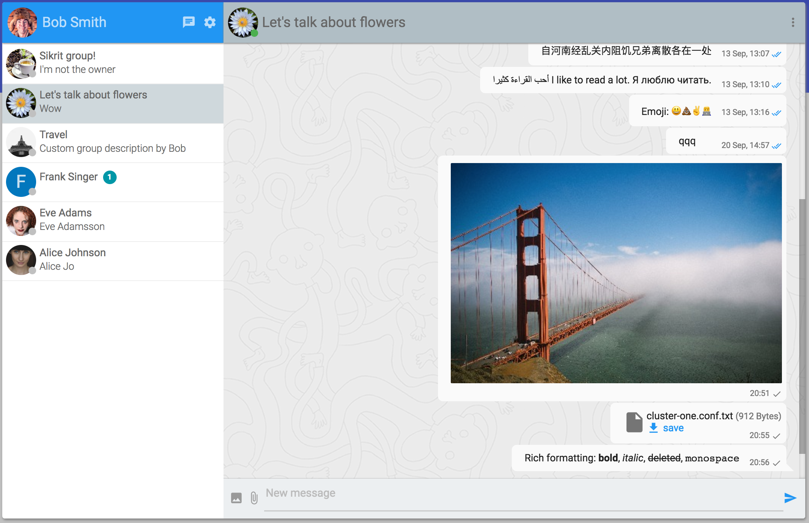
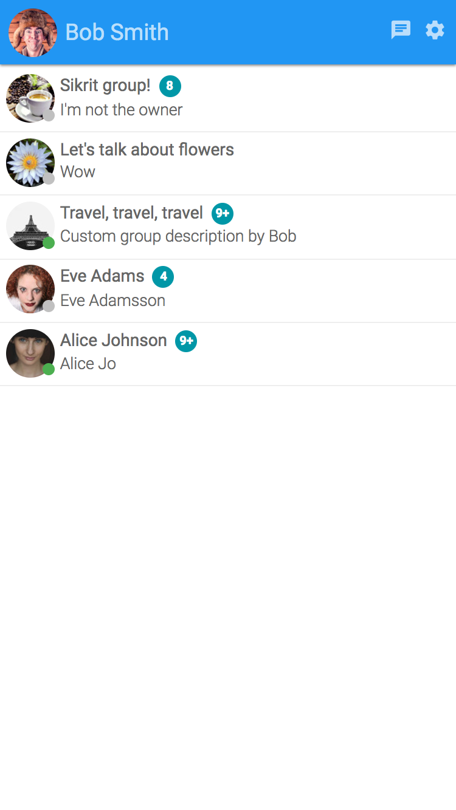

# Tinode Instant Messaging Server

Instant messaging server. Backend in pure [Go](http://golang.org) (license [GPL 3.0](http://www.gnu.org/licenses/gpl-3.0.en.html)), custom client-side binding in Java and Javascript, as well as [gRPC](https://grpc.io/) client support for C++, C#, Go, Java, Node, PHP, Python, Ruby, Objective-C (license [Apache 2.0](http://www.apache.org/licenses/LICENSE-2.0)). Wire transport is JSON over websocket (long polling is also available) for custom bindings, or [protobuf](https://developers.google.com/protocol-buffers/) over plain TCP for gRPC. Persistent storage [RethinkDB](http://rethinkdb.com/) and MySQL (experimental). A third-party [DynamoDB adapter](https://github.com/riandyrn/chat/tree/master/server/db/dynamodb) also exists. Other databases can be supported by writing custom adapters.

Tinode is meant as a replacement for XMPP. On the surface it's a lot like open source WhatsApp or Telegram.

Version 0.14. This is beta-quality software: feature-complete but probably with a few bugs. Follow [instructions](INSTALL.md) to install and run. Read [API documentation](API.md).

A javascript demo is usually available at https://api.tinode.co/x/example-react-js/ ([source](https://github.com/tinode/example-react-js/)). Login as one of `alice`, `bob`, `carol`, `dave`, `frank`. Password is `<login>123`, e.g. login for `alice` is `alice123`. You can discover other users by email or phone by prefixing them with `email:` or `tel:` respectively. Emails are `<login>@example.com`, e.g. `alice@example.com`, phones are `17025550001` through `17025550009`. The demo server is reset (all data wiped) every night at 3:15 am Pacific time. If you see an error message `User not found or offline`, it means the server was reset while you were connected. If yu see it just reload and relogin.

User `Tino` is a [basic chatbot](./chatbot) which responds with a [random quote](http://fortunes.cat-v.org/) to any message.

[Android demo](https://github.com/tinode/android-example) is mostly stable and functional. See screenshots below. 

A text-only [command line client](./tn-cli) implements every possible command.

The demo server is configured to use [ACME](https://letsencrypt.org/) TLS [implementation](https://godoc.org/golang.org/x/crypto/acme) with hard-coded requirement for [SNI](https://en.wikipedia.org/wiki/Server_Name_Indication). If you are unable to connect then the most likely reason is your TLS client's missing support for SNI. Use a different client. 

## Why?

[XMPP](http://xmpp.org/) is a mature specification with support for a very broad spectrum of use cases developed long before mobile became important. As a result most (all?) known XMPP servers are difficult to adapt for the most common use case of a few people messaging each other from mobile devices. Tinode is an attempt to build a modern replacement for XMPP/Jabber focused on a narrow use case of instant messaging between humans with emphasis on mobile communication.

## Features

### Supported

* [Android](https://github.com/tinode/android-example/), [web](https://github.com/tinode/example-react-js/), and [command line](tn-cli/) clients.
* One-on-one messaging.
* Group messaging with every member's access permissions managed individually. The maximum number of members is configurable (128 by default).
* Topic access control with permissions for various actions.
* Server-generated presence notifications for people, topics.
* Sharded clustering with failover.
* Persistent message store, paginated message history.
* Javascript bindings with no external dependencies.
* Java bindings (dependencies: [jackson](https://github.com/FasterXML/jackson), [nv-websocket-client](https://github.com/TakahikoKawasaki/nv-websocket-client)). Suitable for Android but with no Android SDK dependencies.
* Websocket, long polling, and [gRPC](https://grpc.io/) over TCP transports.
* JSON or [protobuf version 3](https://developers.google.com/protocol-buffers/) wire protocols.
* [TLS](https://en.wikipedia.org/wiki/Transport_Layer_Security) with [Letsenrypt](https://letsencrypt.org/) or conventional certificates.
* User search/discovery.
* Rich formatting of messages, markdown-style: \*style\* &rarr; **style**.
* Inline images and file attachments.
* Message status notifications: message delivery to server; received and read notifications; typing notifications.
* Support for client-side caching.
* Ability to block unwanted communication server-side.
* Authentication support customizable at compile time.
* Anonymous users (important for use cases related to tech support over chat).
* Mobile push notifications using [FCM](https://firebase.google.com/docs/cloud-messaging/).
* Plugins to enable chat bots.

### Planned

* iOS client bindings and client.
* Options for transfer of large objects like video.
* End to end encryption with [OTR](https://en.wikipedia.org/wiki/Off-the-Record_Messaging) for one-on-one messaging and undecided method for group messaging.
* Group messaging with unlimited number of members with bearer token access control.
* Hot standby.
* Federation.
* Different levels of message persistence (from strict persistence to "store until delivered" to purely ephemeral messaging).

## Screenshots

### Android

 

### Desktop Web

  

### Mobile Web

  <kbd></kbd> <kbd></kbd> <kbd></kbd> <kbd></kbd>

