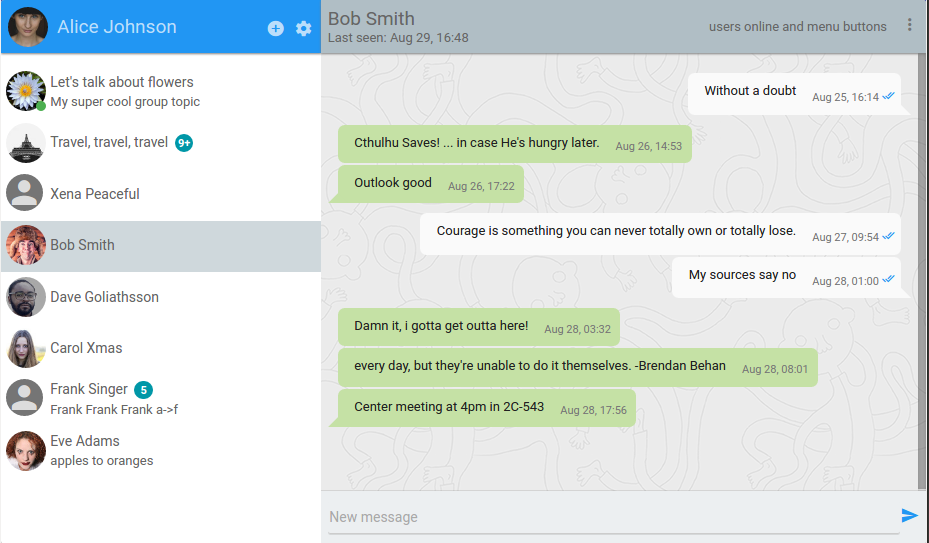

# Tinode Instant Messaging Server

Instant messaging server. Backend in pure [Go](http://golang.org) (license [GPL 3.0](http://www.gnu.org/licenses/gpl-3.0.en.html)), client-side binding in Java for Android and Javascript (license [Apache 2.0](http://www.apache.org/licenses/LICENSE-2.0)), persistent storage [RethinkDB](http://rethinkdb.com/), JSON over websocket (long polling is also available). No UI components other than demo apps. Tinode is meant as a replacement for XMPP.

Version 0.10. This is alpha-quality software. Bugs should be expected. Follow [instructions](INSTALL.md) to install and run. Read [API documentation](API.md).

A javascript demo is (usually) available at http://api.tinode.co/x/example-react-js/ ([source](https://github.com/tinode/example-react-js/)). Login as one of `alice`, `bob`, `carol`, `dave`, `frank`. Password is `<login>123`, e.g. login for `alice` is `alice123`. [Android demo](https://github.com/tinode/android-example) is mostly stable and functional. See screenshots below.

## Why?

[XMPP](http://xmpp.org/) is a mature specification with support for a very broad spectrum of use cases developed long before mobile became important. As a result most (all?) known XMPP servers are difficult to adapt for the most common use case of a few people messaging each other from mobile devices. Tinode is an attempt to build a modern replacement for XMPP/Jabber focused on a narrow use case of instant messaging between humans with emphasis on mobile communication.

## Features

### Supported

* One-on-one messaging.
* Group messaging with currently unlimited number of members where every member's access permissions are managed 
individually. The maximum number of members will be limited to a reasonably high value in the future (256? configurable?).
* Topic access control with permissions for various actions.
* Server-generated presence notifications for people, topics.
* Basic sharded clustering.
* Persistent message store, paginated message history.
* Javascript bindings with no dependencies.
* Android Java bindings (dependencies: [jackson](https://github.com/FasterXML/jackson), [nv-websocket-client](https://github.com/TakahikoKawasaki/nv-websocket-client))
* Websocket transport.
* JSON wire protocol.
* User search/discovery.
* Message status notifications: message delivery to server; received and read notifications; typing notifications.
* Support for client-side caching.
* Ability to block unwanted communication server-side.
* Authentication support customizable at compile time.
* Mobile push notifications using [FCM](https://firebase.google.com/docs/cloud-messaging/).

### Planned

* iOS client bindings.
* Security: [TLS](https://en.wikipedia.org/wiki/Transport_Layer_Security) for all communications plus [OTR](https://en.wikipedia.org/wiki/Off-the-Record_Messaging) for one-on-one messaging and undecided method for group mesaging.
* Support for long polling (currently exists but broken).
* Group messaging with unlimited number of members with bearer token access control.
* Failover/hot standby/replication.
* Federation.
* Different levels of message persistence (from strict persistence to store until delivered to purely ephemeral messaging).
* Support for binary wire protocol.
* Anonymous users.
* Support for other SQL and NoSQL backends.
* Plugins.

## Screenshots

### Web

### Android

