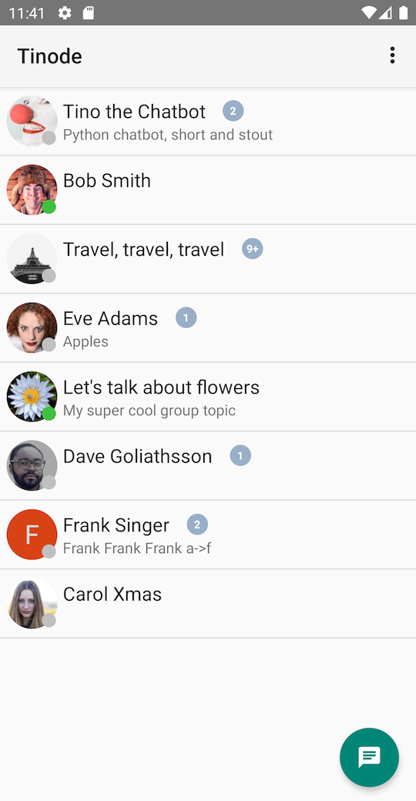
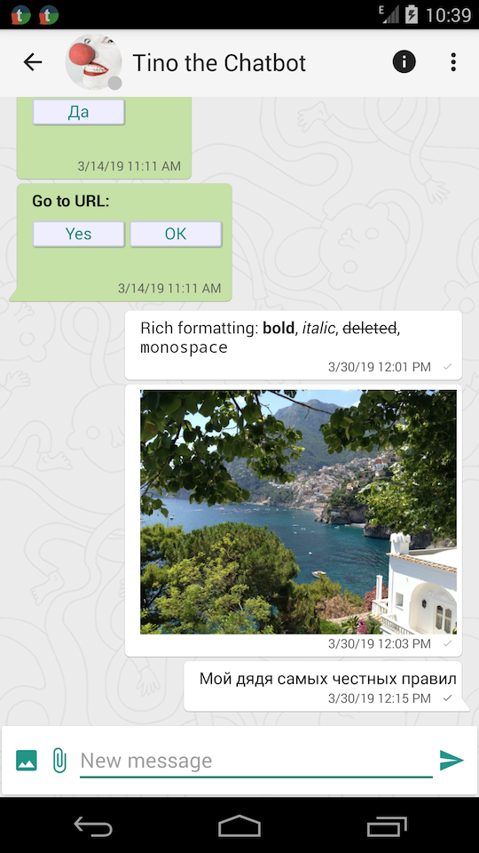
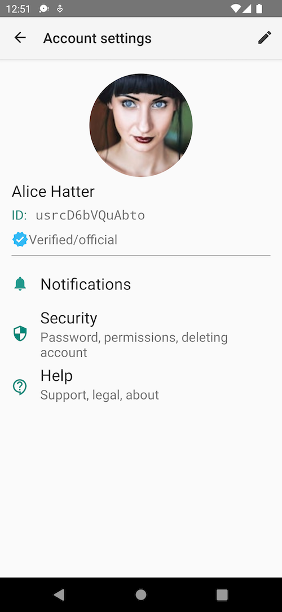
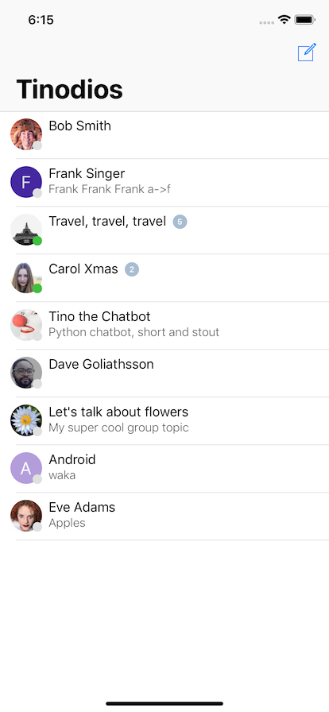
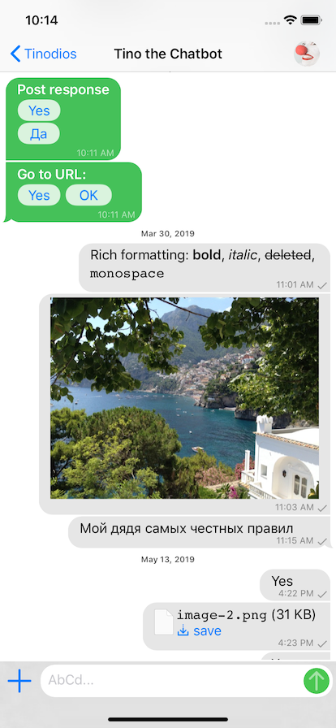
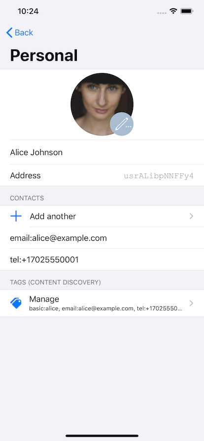
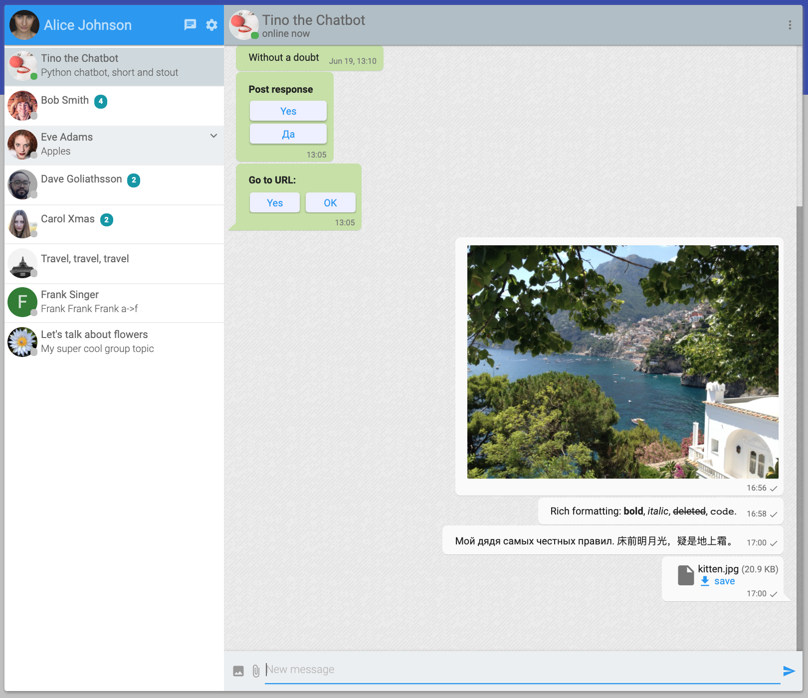
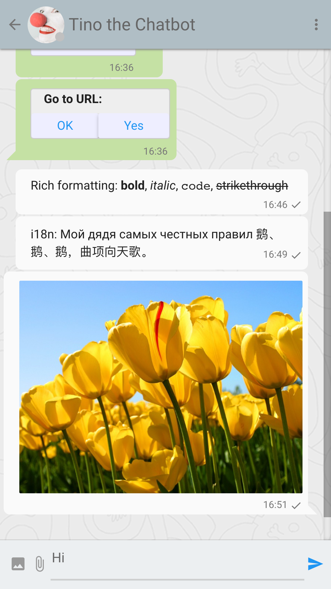
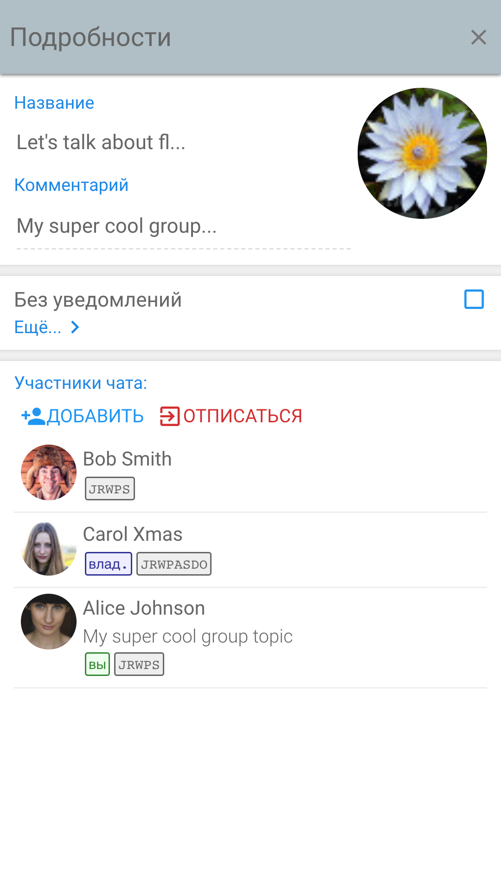

# Tinode 인스턴트 메시징 서버

## This document is outdated. For up to date info use [README.md](./README.md)

 인스턴트 메시징 서버. C++, C#, [Go](http://golang.org), Java, Node, PHP, Python, Ruby, Objective-C 등에 대한 [gRPC](https://grpc.io/) 클라이언트 지원은 물론 순수Go(라이선스 [GPL 3.0](http://www.gnu.org/licenses/gpl-3.0.en.html))의 백엔드와 Java,Javasript 및 Swift의 클라이언트 측 바인딩(라이선스 [Apache 2.0](http://www.apache.org/licenses/LICENSE-2.0)). 와이어 전송은 사용자 정의 바인딩을 위해 웹소켓을 통한 JSON(롱 폴링도 가능) 즉, gRPC와 [protobuf](https://developers.google.com/protocol-buffers/). 영구 저장소 [RethinkDB](http://rethinkdb.com/), MySQL 및 MongoDB(실험적). 지원되지 않는 타사 [DynamoDB adapter](https://github.com/riandyrn/chat/tree/master/server/db/dynamodb) adapter도 있습니다. 사용자 정의 어댑터를 작성하여 다른 데이터베이스를 지원할 수 있습니다.

Tinode는 XMPP/ Jabber 가 아닙니다. Tinode는 XMPP와 호환되지 않습니다. XMPP를 대체하기 위한 것입니다. 표면적으로는 오픈소스 WhatsApp 또는 Telegram과 매우 유사합니다.

버전 0.16은 베타 급 소프트웨어입니다. 기능은 완전하지만 몇 가지 버그가 있습니다. 아래 클라우드 서비스 중 하나를 설치 및 실행하거나 사용하려면 [지시사항](INSTALL.md)을 따르십시오. [API 설명서](docs/API.md)를 읽으십시오.

  

## Why?

[XMPP](http://xmpp.org/)의 약속은 연합된 인스턴스 메시징을 제공하는 것입니다. 누구나 전세계의 다른 XMPP서버와 메시지를 교환할 수 있는 IM 서버를 가동할 수 있습니다. 불행하게도, XMPP는 이 약속을 이행하지 않았습니다. 인스턴트 메신저들은 1990년대 후반의 AoL공개 인터넷과 비슷한, 양립할 수 없는 벽으로 둘러싸인 정원의 무리들입니다.

이 프로젝트의 목표는 XMPP의 원래 비전인 모바일 통신을 강조하여 연합 인스턴트 메시징을 위한 현대적인 개방형 플랫폼을 만드는 것입니다. 두 번째 목표는 정부가 추적하고 차단하기 훨씬 어려운 분산형 IM플랫폼을 만드는 것입니다.

XMPP: XML에 기반한 메시지 지향 통신 프로토콜

IM: Instant Messanger

## 설치 및 실행

[일반 지침](./INSTALL.md) 또는 [도커별 지침](./docker/README.md)을 참조하십시오.

## 지원받기

* [API 설명서](docs/API.md) 및 [FAQ](docs/faq.md)를 읽으십시오.
* 지원, 일반적인 질문, 토로은[https://groups.google.com/d/forum/tinode](https://groups.google.com/d/forum/tinode).에 게시하십시오.
* 버그 및 기능 요청에 대해서는 [issue](https://github.com/tinode/chat/issues/new)를 여십시오.

## 공공서비스

[Tinode 공공 서비스](https://web.tinode.co/)는 지금 바로 사용할 수 있습니다. 다른 메신저들처럼 사용하면 됩니다. [샌드박스](https://sandbox.tinode.co/)에 있는 데모 계정은 공공 서비스에서 사용할 수 없습니다. 서비스를 이용하려면 유효한 이메일을 사용하여 계정을 등록해야 합니다.

### 웹

Tinode웹은 단일 페이지의 웹으로 https://web.tinode.co/ ([원본](https://github.com/tinode/webapp/))에서 이용이 가능합니다. . 아래에 있는 스크린 샷을 참고하세요. 현재 영어, 중국어 간체, 러시아어를 지원합니다. 더 많은 번역을 환영합니다.

### 안드로이드

Tindroid라고 불리는 [안드로이드 버전의 Tinode](https://play.google.com/store/apps/details?id=co.tinode.tindroidx) 는 안정적으로 가동됩니다.  ([원본](https://github.com/tinode/tindroid)).  아래에 있는 스크린 샷을 참고하세요. 편의를 위해 [디버그 APK](https://github.com/tinode/tindroid/releases/latest)도 제공합니다. 현재 영어, 중국어 간체, 러시아어를 지원합니다. 더 많은 번역을 환영합니다.

### iOS

Tinodios라고 불리는 [iOS 버전의 Tinode](https://apps.apple.com/app/reference-to-tinodios-here/id123) 안정적으로 가동됩니다.([원본](https://github.com/tinode/ios)). 아래에 있는 스크린샷을 참고하세요. 현재 영어와 중국어 간체를 지원합니다. 더 많은 번역을 환영합니다.

## 데모/샌드박스
샌드박스 데모 버전은 https://sandbox.tinode.co/ 에서 이용 가능합니다.

alice, bob, carol, dave, frank 중 하나로 로그인할 수 있습니다. 비밀번호는 <이름>123으로 예를 들어, alice의 비밀번호는 alice123입니다. 사용자 이름을 맨 앞에쓴 <이름>@example.com 형식의 이메일이나 +17025550001 부터 +17025550009의 전화번호를 이용해서 다른 사용자들을 찾을 수 있습니다.

새로운 계정을 등록하면 유효성 검사 코드를 보낼 이메일 주소를 묻는 메시지가 나타납니다. 데모의 목적으로 123456을 범용 유효성 검사 코드로 사용할 수 있습니다. 실제 이메일로 받은 코드도 유효합니다.

### 샌드박스 노트

* 샌드박스 서버는 태평양 표준시 기준 매일 오전 3시 15분에 초기화됩니다(모든 데이터가 지워짐). 사용자를 찾을 수 없습니다 또는 오프라인 같은 오류 메시지는 서버에 연결하는 동안 서버가 초기화 되었음을 의미합니다. 만약 해당 오류 메시지가 표시되면 새로고침 후 다시 로그인 하세요. 안드로이드에서 로그아웃 후 다시 로그인 하세요. 만약 데이터베이스가 변경된 경우에는 앱을 삭제했다가 다시 설치하면 됩니다.
* 샌드박스 유저 Tino는 [기본적인 챗봇](./chatbot)으로 모든 메시지에 [임의의 인용구](http://fortunes.cat-v.org/)로 응답합니다.
* 일반적으로 새로운 계정을 등록하면 이메일 주소를 묻는 메시지가 표시됩니다. 서버는 유효성 검사 코드가 포함된 메일을 보내며 이를 사용하여 계정을 검증하는 데 사용할 수 있습니다. 테스트를 보다 쉽게 할 수 있도록 서버는 유효성 검사 코드로 123456을 또한 허용합니다. Tinode.conf에서 ”debug_response”: “123456”행을 제거하여 이 옵션을 비활성화 시킬 수 있습니다.
* 샌드박스 서버는 [SNI](https://en.wikipedia.org/wiki/Server_Name_Indication)에 대한 하드 코딩된 요구사항과 함께 [ACME](https://letsencrypt.org/) TLS [구현](https://godoc.org/golang.org/x/crypto/acme)을 사용하도록 구성되었습니다. 만약 연결할 수 없을 경우 TLS 클라이언트의 SNI 지원 누락일 가능성이 높습니다. 그 경우 다른 클라이언트를 사용하세요.
* 기본 웹 앱은 하나의 축소된 자바스크립트 번들과 축소된 CSS를 가져옵니다. 축소되지 않은 버전은 https://sandbox.tinode.co/index-dev.html 에서도 제공됩니다.
* 데모가 같은 [도커 이미지](https://hub.docker.com/u/tinode/)도 사용 가능합니다.
* 샌드박스에 대해 소프트웨어를 테스트하고 해킹하는 작업, 기타 작업들을 수행할 수 있습니다. DDos는 절대 사용하지 마세요.

## 특징

### 지원 기능

* [Android](https://github.com/tinode/tindroid/), [iOS](https://github.com/tinode/ios), [web](https://github.com/tinode/webapp/), 그리고 [command line](tn-cli/) 클라이언트.
* 1대1 메시징.
* 모든 구성원의 접근 권한을 가진 그룹 메시징을 개별적으로 관리한다. 최대 구성원 수는 설정할 수 있다(기본적으로 128명).
* 다양한 작업에 대한 권한을 가진 항목 액세스 제어
* 서버에서 생성한 사용자 및 주제에 대한 존재 알림.
* 맞춤형 인증 지원
* failover를 통한 Sharded clustering
* 영구 메시지 저장소, 페이지가 지정된 메시지 기록
* 외부 의존성이 없는 javascript 바인딩.
* Android SDK dependencies.Java 바인딩(의존성: [Jackson](https://github.com/FasterXML/jackson), [Java-Websocket](https://github.com/TooTallNate/Java-WebSocket)). Android에 적합하지만 Android SDK 종속성이 없음.
* TCP 또는 Unix 소켓을 통한 Webocket, long polling, 및 [gRPC](https://grpc.io/).
* JSON 또는[protobuf 버전 3](https://developers.google.com/protocol-buffers/) 와이어 프로토콜.
* [암호화](https://letsencrypt.org/) 또는 기존 인증서를 내장한 [TLS](https://en.wikipedia.org/wiki/Transport_Layer_Security) 옵션
* 사용자 검색/발견.
* 풍부한 메시지 형식, 마크다운 스타일: \*style\* &rarr; **style**.
* 인라인 이미지 및 첨부 파일.
* 챗봇에 적합한 양식 및 템플리트 응답.
* 메시지 상태 알림: 서버로 메시지 전달; 수신 및 읽기 알림; 입력 알림.
* 클라이언트 측 데이터 캐싱 지원.
* 원하지 않는 통신 서버를 차단하는 기능.
* 익명 사용자(대화 중 기술 지원 관련 사용 사례에 중요성).
* [FCM](https://firebase.google.com/docs/cloud-messaging/) 또는 [TNPG](server/push/tnpg/)를 사용하여 알림을 푸시.
* 로컬 파일 시스템 또는 Amazon S3를 사용하여 비디오 파일과 같은 대형 오브젝트의 저장 및 대역 외 전송.
* 챗봇을 활성화하기 위해 기능을 확장하는 플러그인.

### 계획

* [연방(연합,연맹)](https://en.wikipedia.org/wiki/Federation_(information_technology)).
* 일대일 메시징을 위한 [OTR](https://en.wikipedia.org/wiki/Off-the-Record_Messaging)과 그룹 메시징을 위한 미확정 방법으로 End to end 암호화.
* bearer token 액세스 제어를 가진 무제한 회원(또는 수십만 명)의 그룹 메시징.
* 자동 예비 시스템.
* 메시지 지속성 다른 수준(엄격한 지속성부터 "전달될 때까지 저장"까지, 완전히 짧은 메시징까지).

### 번역

모든 클라이언트 소프트웨어는 국제화를 지원한다. 번역은 영어, 중국어 간체, 러시아어(iOS 제외)에 제공된다. 더 많은 번역을 환영한다. 특히 스페인어, 아랍어, 독일어, 페르시아어, 인도네시아어, 포르투갈어, 힌디어, 벵골어에 관심이 많다.

## 타사 라이선스

* 데모 아바타와 일부 다른 그래픽은 [CC0](https://www.pexels.com/photo-license/) 라이센스에 따라 https://www.pexels.com/에서 제공된다.
* 웹 및 안드로이드 배경 패턴은 [CC BY-SA 3.0](https://creativecommons.org/licenses/by-sa/3.0/) 라이센스에 따라 http://subtlepatterns.com/ 에서 제공된다.
* Android 아이콘은 [Apache 2.0](https://www.apache.org/licenses/LICENSE-2.0.html) 라이센스의 https://material.io/tools/icons/ 에서 제공된다.
* 일부 iOS 아이콘은 [CC BY-ND 3.0](https://icons8.com/license) 라이센스에 따라 https://icons8.com/ 에서 제공된다.

## 스크린샷

### [안드로이드](https://github.com/tinode/tindroid/)

### [iOS](https://github.com/tinode/ios)

  

### [데스크탑 웹](https://github.com/tinode/webapp/)

  

### [모바일 웹](https://github.com/tinode/webapp/)

    

#### SEO 문자열

중국어, 러시아어, 페르시아어 및 다른 몇 가지 언어로 '챗'과 '인스턴트 메시징'을 표시한다.

* 聊天室 即時通訊
* чат мессенджер
* インスタントメッセージ
* 인스턴트 메신저
* پیام‌رسانی فوری گپ
* تراسل فوري
* Nhắn tin tức thời
* anlık mesajlaşma sohbet
* mensageiro instantâneo
* pesan instan
* mensajería instantánea
