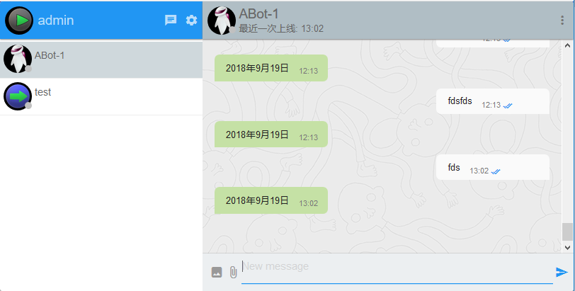

# Tinode Chatbot Example for .Net or .NetCore

This is a rudimentary chatbot for Tinode using [gRPC API](../pbx/). It's written in C# as a demonstration
that the API is language-independent.

The chat bot subscribes to events stream using Plugin API and logs in as a regular user. The event stream API is used to listen for creation of new accounts. When a new account is created, the bot initiates a p2p topic with the new user. Then it listens for messages sent to the topic and responds to each with a random quote from `quotes.txt` file.

Generated files are provided for convenience in a [separate folder](./Tinode.ChatBot). You may re-generate them if needed:
### for Windows
```
generate_proto.bat
```

### for Linux/Mac
```
generate_proto.sh
```

There is already a .net standard library implement for chatbot as "Tinode.ChatBot", and there are two applicaion implentat for .net framework4.6.1 and .net core2.0
they are "Tinode.ChatBot.DemoNet46" and "Tinode.ChatBot.DemoNetCore".

#### you can use VistualStudio2017 to open it : [ChatBot.sln](./ChatBot.sln)

#### if you want define your own bot, Just follow these steps:
* Add `Tinode.ChatBot`libaray to your project;
* Add `Google.Protobuf`,`Grpc.Core`,`Newtonsoft.Json` to your project from Nuget;
* Implement your own `IBotResponse` interface,such as :

```C#
        /// <summary>
        /// ChatBot auto reply implement
        /// </summary>
        public class BotReponse : IBotResponse
        {
            public string ThinkAndReply(ServerData message)
            {
                return DateTime.Now.ToLongDateString();
            }
        }
```

* build your chatbot,for example:

```C#
 class Program
    {
        public class CmdOptions
        {
            [Option('C', "login-cookie", Required = false, Default = ".tn-cookie", HelpText = "read credentials from the provided cookie file")]
            public string CookieFile { get; set; }
            [Option('T', "login-token", Required = false, HelpText = "login using token authentication")]
            public string Token { get; set; }
            [Option('B', "login-basic", Required = false, HelpText = "login using basic authentication username:password")]
            public string Basic { get; set; }
            [Option('L', "listen", Required = false, Default = "0.0.0.0:40052", HelpText = "address to listen on for incoming Plugin API calls")]
            public string Listen { get; set; }
            [Option('S', "server", Required = false, Default = "localhost:6061", HelpText = "address of Tinode server gRPC endpoint")]
            public string Host { get; set; }
        }

        /// <summary>
        /// ChatBot auto reply implement
        /// </summary>
        public class BotReponse : IBotResponse
        {
            public string ThinkAndReply(ServerData message)
            {
                return DateTime.Now.ToLongDateString();
            }
        }

        static ChatBot bot;
        static void Main(string[] args)
        {
            Console.CancelKeyPress += Console_CancelKeyPress;
            string schemaArg = string.Empty;
            string secretArg = string.Empty;
            string cookieFile = string.Empty;
            string host = string.Empty;
            string listen = string.Empty;
            Parser.Default.ParseArguments<CmdOptions>(args)
                   .WithParsed<CmdOptions>(o =>
                   {
                       if (!string.IsNullOrEmpty(o.Host))
                       {
                           host = o.Host;
                           Console.WriteLine($"gRPC server:{host}");
                       }
                       if (!string.IsNullOrEmpty(o.Listen))
                       {
                           listen = o.Listen;
                           Console.WriteLine($"Plugin API calls Listen server:{listen}");
                       }
                       if (!string.IsNullOrEmpty(o.Token))
                       {
                           schemaArg = "token";
                           secretArg = Encoding.ASCII.GetString(Encoding.Default.GetBytes(o.Token));
                           Console.WriteLine($"Login in with token {o.Token}");
                           bot = new ChatBot(serverHost: host, listen: listen, schema: schemaArg, secret: secretArg);
                       }
                       else if (!string.IsNullOrEmpty(o.Basic))
                       {
                           schemaArg = "basic";
                           secretArg = Encoding.UTF8.GetString(Encoding.Default.GetBytes(o.Basic));
                           Console.WriteLine($"Login in with login:password {o.Basic}");
                           bot = new ChatBot(serverHost: host, listen: listen, schema: schemaArg, secret: secretArg);
                       }
                       else
                       {
                           cookieFile = o.CookieFile;
                           Console.WriteLine($"Login in with cookie file {o.CookieFile}");
                           bot = new ChatBot(serverHost: host, listen: listen, cookie: cookieFile, schema: string.Empty, secret: string.Empty);
                           if (bot.ReadAuthCookie(out var schem, out var secret))
                           {
                               bot.Schema = schem;
                               bot.Secret = secret;
                           }
                           else
                           {
                               Console.WriteLine("Login in with cookie file failed, please check your credentials and try again... Press any key to exit.");
                               Console.ReadKey();
                               return;
                           }
                       }
                       bot.BotResponse = new BotReponse();
                       bot.Start().Wait();

                       Console.WriteLine("[Bye Bye] ChatBot Stopped");
                   });

        }

        private static void Console_CancelKeyPress(object sender, ConsoleCancelEventArgs e)
        {
            bot.Stop();
        }
    }
```

#### example screenshot



