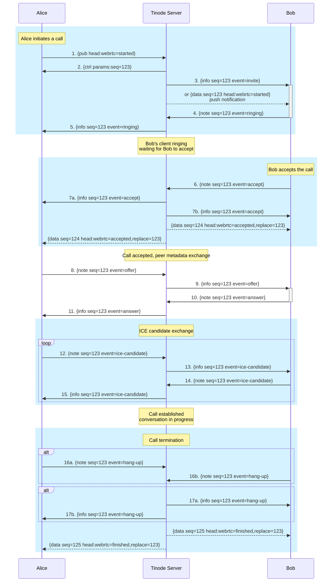

# Video Call Establishment Flow

Tinode supports peer to peer video calls over [WebRTC](https://webrtc.org/). The diagram below illustrates a call establishment flow between two users `Alice` and `Bob`. The flow is conceptually similar to [SIP](https://en.wikipedia.org/wiki/Session_Initiation_Protocol), but uses native Tinode messages for transport.

Notes:
- All communication is proxied by the Tinode server.
- Client-to-server events are dispatched in `{note}` messages with the call's `topic` and `seq` fields set.
- Server-to-client data are routed in `{info}` messages on `me` topic with the call's `src` (call topic) and `seq` fields set (and/or in data push notifications).
- It's assumed that both Alice and Bob may have multiple devices.

## Details
### Call phases
The flow may be broken down into 4 phases:
* Steps 1-5: call initiation
* Steps 6-7: call acceptance
* Steps 8-15: metadata exchange
* Steps 16-17: call termination

### Call Establishment & Termination steps

#### Call initiation
1. `Alice` initiates a call by posting a video call message (with `webrtc=started` header)
2. Server replies with a `{ctrl}` message containing the `seq` id of the call.
3. Server routes an `invite` event message to `Bob` (all clients).
  - Additionally, server sends data push notifications containing a `webrtc=started` field to `Bob`.
  - Upon receiving either of the above, `Bob` displays the incoming call UI.
4. `Bob` replies with a `ringing` event.
5. Server relays the `ringing` event to `Alice`. The latter now plays the ringing sound.
  - Note that `Alice` may receive multiple `ringing` events as each separate instance of `Bob` acknowldges receipt of the call invitation separately.
  - `Alice` and server will wait for up to a server configured timeout for `Bob` to accept the call and then hang up.
  - At this point, the call is officially **initiated**.

#### Call acceptance
6. `Bob` accepts the call by sending an `accept` event.
7. (a) and (b): Server routes `accept` event to `Alice` and `Bob`.
  - Additionally, the server broadcasts a replacement for the call data message with `webrtc=accepted` header.
  - Push notifications for the replacement message are sent as well.
  - `Bob`'s sessions except the one that accepted the call may silently dismiss the incoming call UI.
  - At this point, the call is officially **accepted**.

#### Metadata exchange
8. `Alice` sends an `offer` event containing an SDP payload.
9. Server routes the `offer` to `Bob`.
10. Upon receiving the `offer`, `Bob` replies with an `answer` event containing an SDP payload.
11. Server forwards `Bob`'s `answer` event to `Alice`.

Steps 12-15 are Ice candidate exchange between `Alice` and `Bob`.
At this point the call is officially **established**. `Alice` and `Bob` can see and hear each other.

#### Call termination
16. `Alice` sends a `hang-up` event to server.
17. Server routes a `hang-up` event to `Bob`.

Additionally, the server broadcasts a replacement for the call data message with `webrtc=finished` header.
Push notifications for the replacement message are sent as well.

